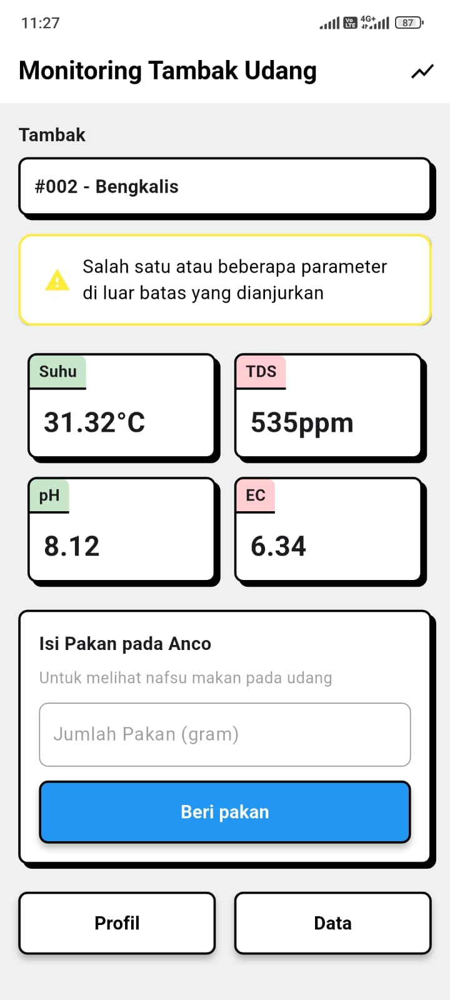
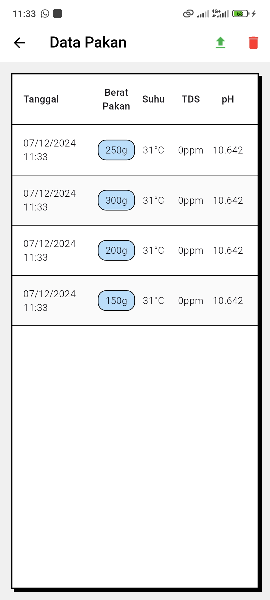
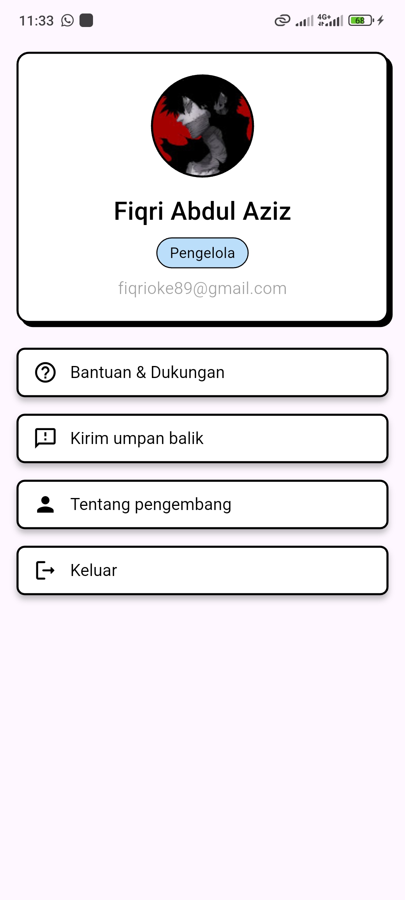
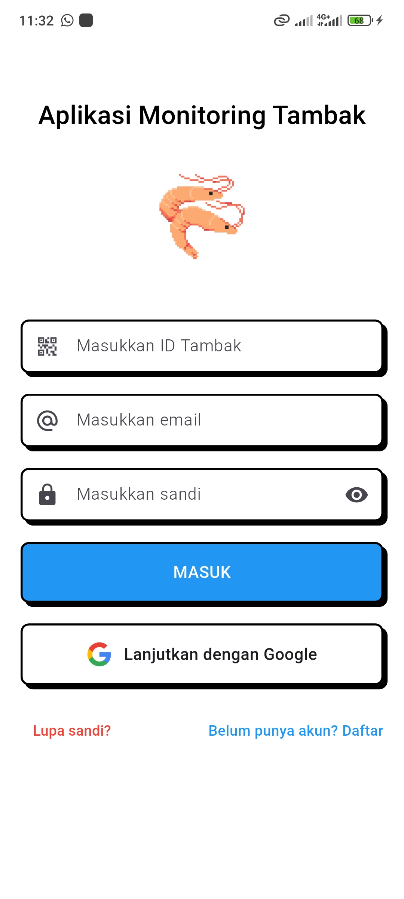
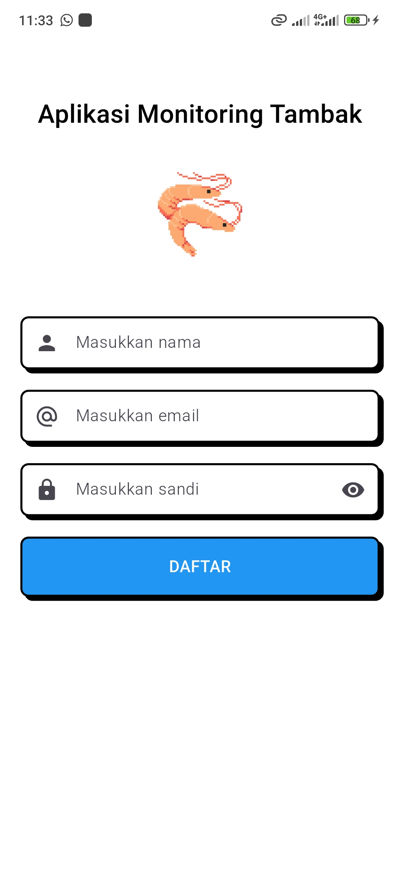

# Monitoring Tambak Udang

Aplikasi **Monitoring Tambak Udang** adalah solusi pintar berbasis Flutter yang dirancang untuk memantau kondisi tambak udang secara real-time. Dengan integrasi **Firebase** dan perangkat IoT menggunakan **ESP32**, aplikasi ini memberikan kemudahan bagi petambak dalam menjaga kualitas air tambak untuk mendukung pertumbuhan udang yang optimal.

## Fitur Utama
- **Pemantauan Real-Time**: Pantau suhu, pH, TDS, dan EC air tambak langsung dari aplikasi.
- **Riwayat Data**: Lihat riwayat parameter tambak untuk analisis mendalam.
- **Ekspor Data**: Ubah data ke dalam bentuk CSV.
- **Kendali IoT**: Kendalikan perangkat tambak seperti pemberi pakan pada anco melalui aplikasi.
- **Tampilan Modern**: Antarmuka pengguna yang bersih, intuitif, dan responsif.

## Teknologi yang Digunakan
- **Flutter**: Framework utama untuk pengembangan aplikasi mobile.
- **Firebase**: Backend real-time untuk pengelolaan database dan autentikasi.
- **ESP32**: Mikrokontroler untuk menghubungkan sensor ke aplikasi melalui protokol HTTP.
- **REST API**: Komunikasi antara aplikasi dan perangkat IoT.

## Screenshot Aplikasi

| Home                   | Data                     | Profil                   | Login                   | Sign Up                 |
|-----------------------------|--------------------------|--------------------------|-------------------------|-------------------------|
|  |  |  |  |  |


## Instalasi
1. **Clone repository**:
   ```bash
   git clone https://github.com/zizfiq/monitoring.git
2. **Masuk ke direktori project: Pindah ke direktori project yang sudah di-clone**:
   ```bash
   cd monitoring
3. **Install dependencies**:
   ```bash
   flutter pub get
4. **Jalankan aplikasi**:
   ```bash
   flutter run

## Konfigurasi

1. **Firebase**:
   - Tambahkan file `google-services.json` (untuk Android) dan/atau `GoogleService-Info.plist` (untuk iOS) ke direktori masing-masing platform.
   - Konfigurasikan **Realtime Database** atau **Firestore** untuk menyimpan data sensor tambak.

2. **ESP32**:
   - Upload kode ESP32 untuk membaca data dari sensor (suhu, pH, TDS, EC) dan mengirimkannya ke Firebase.
   - Gunakan protokol **HTTP** untuk komunikasi data antara ESP32 dan aplikasi.

---

## Cara Kerja

1. **Sensor IoT**: ESP32 membaca data dari sensor yang terhubung di tambak.
2. **Pengiriman Data**: Data sensor dikirimkan ke Firebase secara berkala.
3. **Pemantauan Aplikasi**: Aplikasi Flutter menampilkan data secara real-time melalui dashboard.
4. **Kontrol IoT**: Pengguna dapat mengontrol perangkat tambak yaitu servo dalam memberi pakan pada anco langsung dari aplikasi.

---

## Roadmap

- [x] Pemantauan sensor real-time.
- [x] Kendali perangkat IoT.
- [ ] Push notification.
- [ ] Mode offline untuk data tambak.

---

## Lisensi

Proyek ini dilisensikan di bawah [MIT License](LICENSE).
